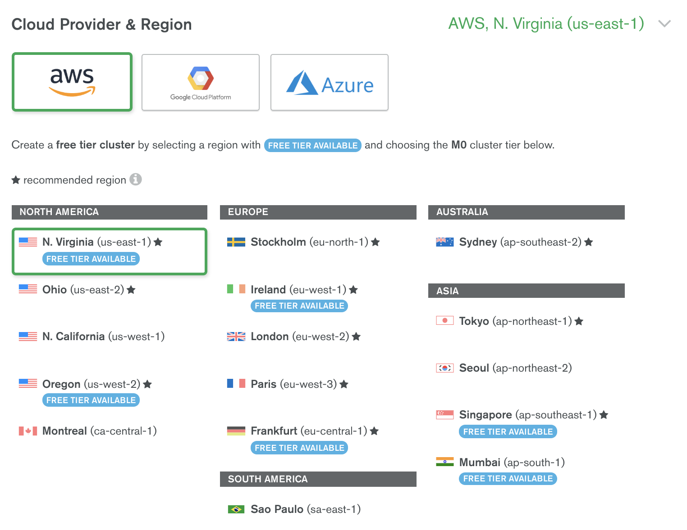
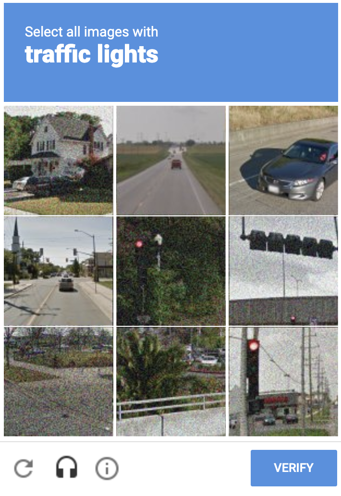

## Deploying an Atlas Cluster

Create an Account or Log In to Atas
We’ll be using MongoDB Atlas, our fully managed Database as a Service, for this workshop. Go to [https://cloud.mongodb.com](https://cloud.mongodb.com) and either create a new account or log into an existing account you may have previously created.

### Create a Free Tier Cluster
#### Click Build a Cluster

Take a moment to browse the options (Provider & Region, Cluster Tier, Version, Backup, …). For our workshop, select AWS as the Cloud Provider:

Leave the remaing options set to the defaults and skip down to the bottom section where you can set the Cluster Name.

Set the Cluster Name - This can be whatever you like.

Now, click create to create the cluster. 

Note: You may be prompted to prove that you are a human by selecting images that match a certain pattern.

Next, you will see your cluster with a blue banner along the top indicating that changes are being deployed. This will take approximately 7 minutes to complete the provisioning process.

