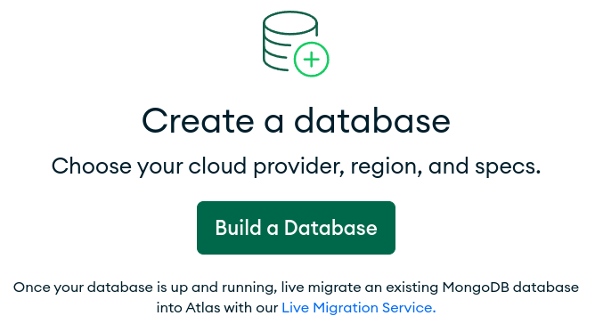
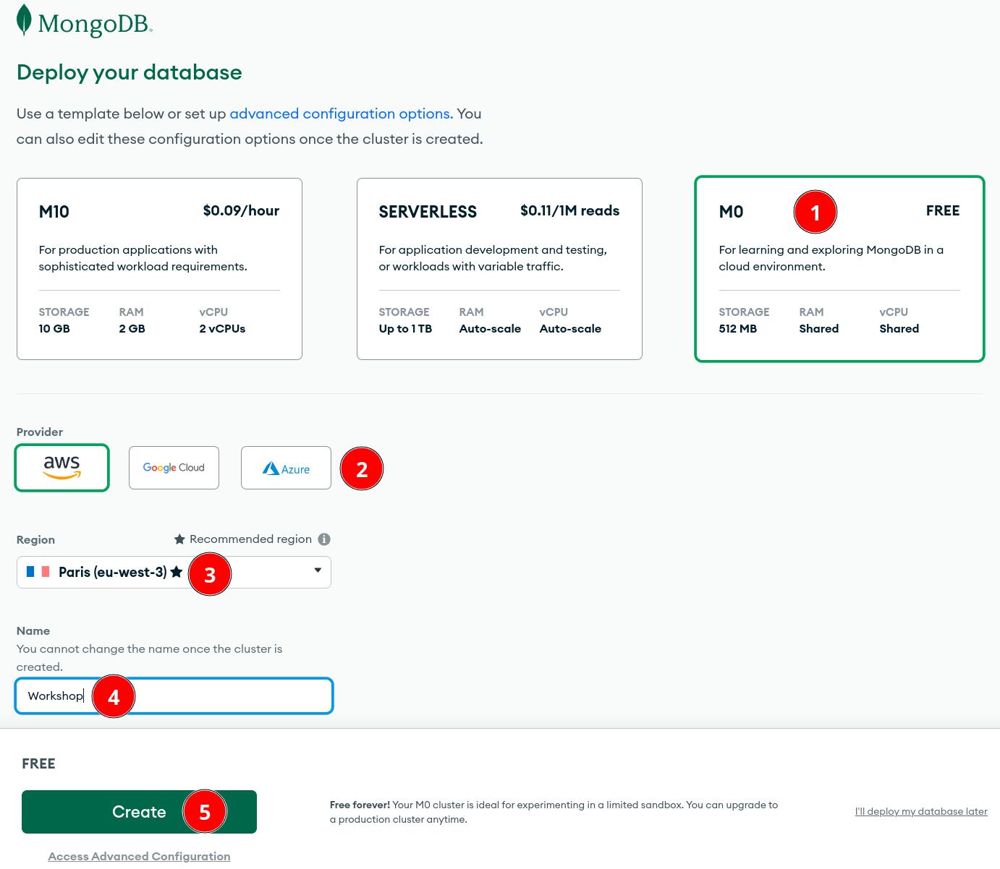
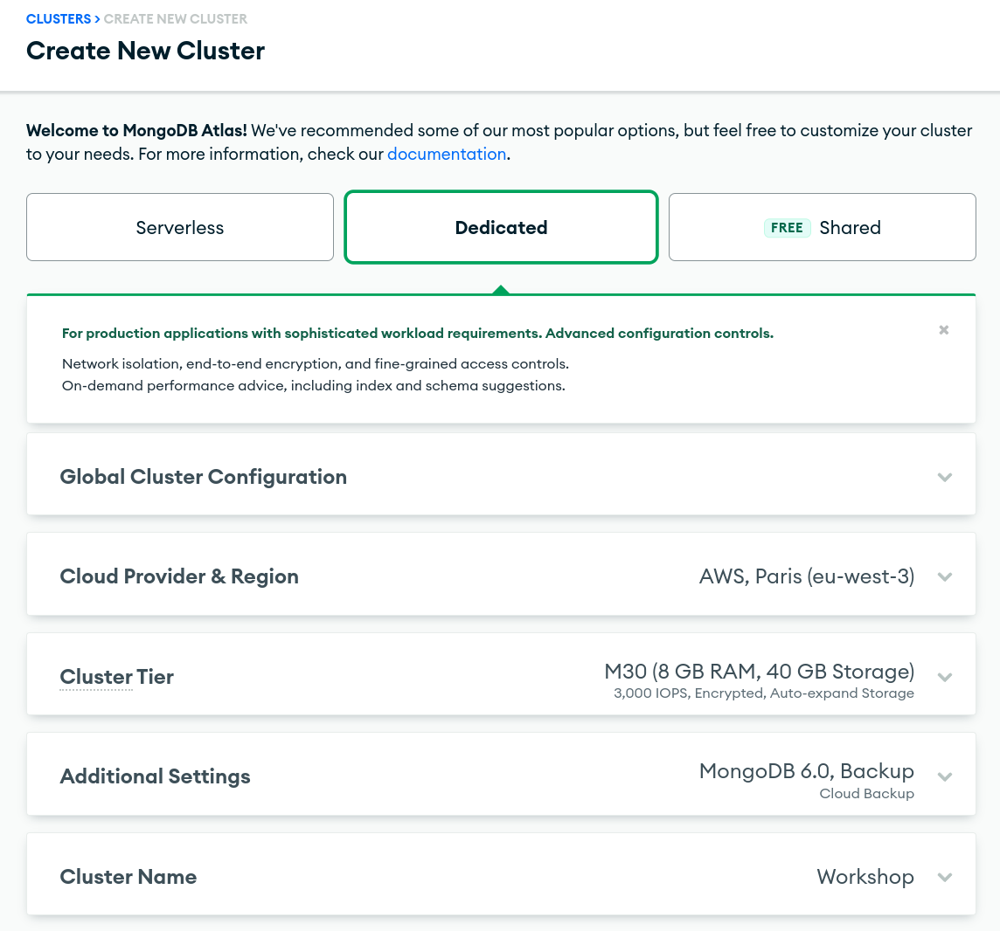
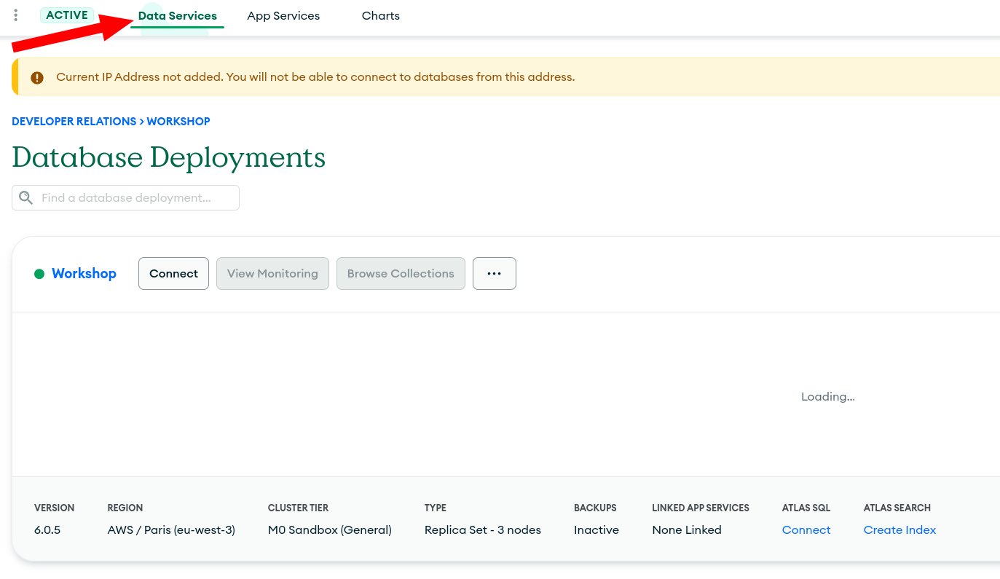

## Deploying an Atlas Cluster

We’ll be using MongoDB Atlas, our fully managed Database as a Service, for this workshop.

Create an Account or Log In to [Atlas](https://cloud.mongodb.com).

Create a new Atlas project to use in this workshop if you are using an existing account.

> Note that the Atlas team sometimes experiment with the UI to make things more intuitive – that means that your experience might not match what you see here.

### Create a Free Tier Cluster

You goal for this section is to Create a MongoDB Atlas M0 cluster which is free forever. 

Depending if you are using a brand new account or an existing one, your experience might differ a little but it should look like this:

Then you can select:
- your cluster tier: here we are using a free M0 cluster.
- your cloud provider: up to you.
- your region: a region near your current location will reduce the latency.
- your fancy cluster name.

Before you move to the next step, take a moment to explore all the options in the `Access Advanced Configuration`.

Take a moment to browse the options (Provider & Region, Cluster Tier, Version, Backup, …).

Notice that MongoDB Atlas supports different type of clusters: 

- Serverless
- Dedicated
- Shared

Dedicated clusters offer many options. Fell free to explore them.

If you haven't clicked the `Create` button to create your M0 cluster yet, you can do it now. 

In the `Data Services` tab, you'll see your cluster being deployed. The provisioning process will take a couple of minutes to complete.

You can now head to [Load Sample Data](../02-Load-Sample-Data/) section.
