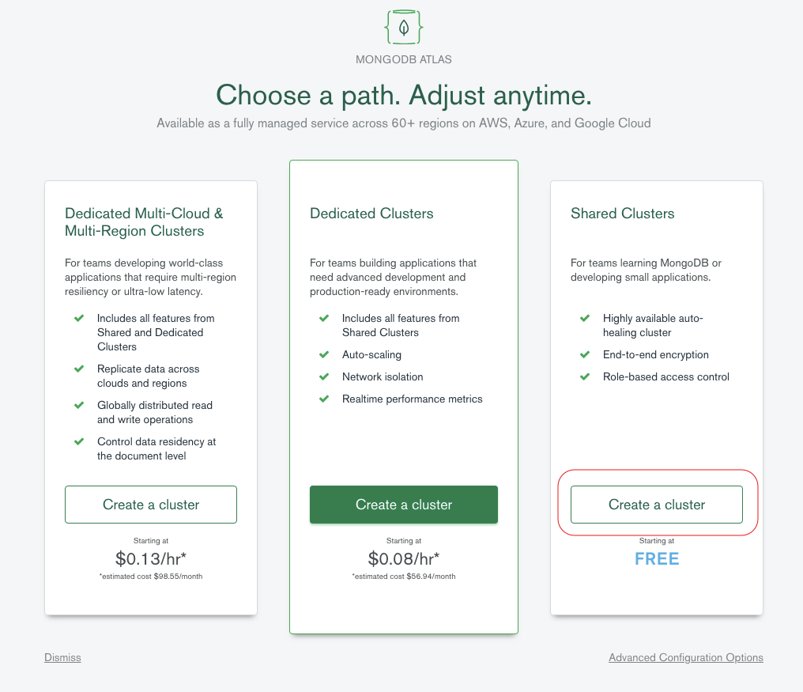
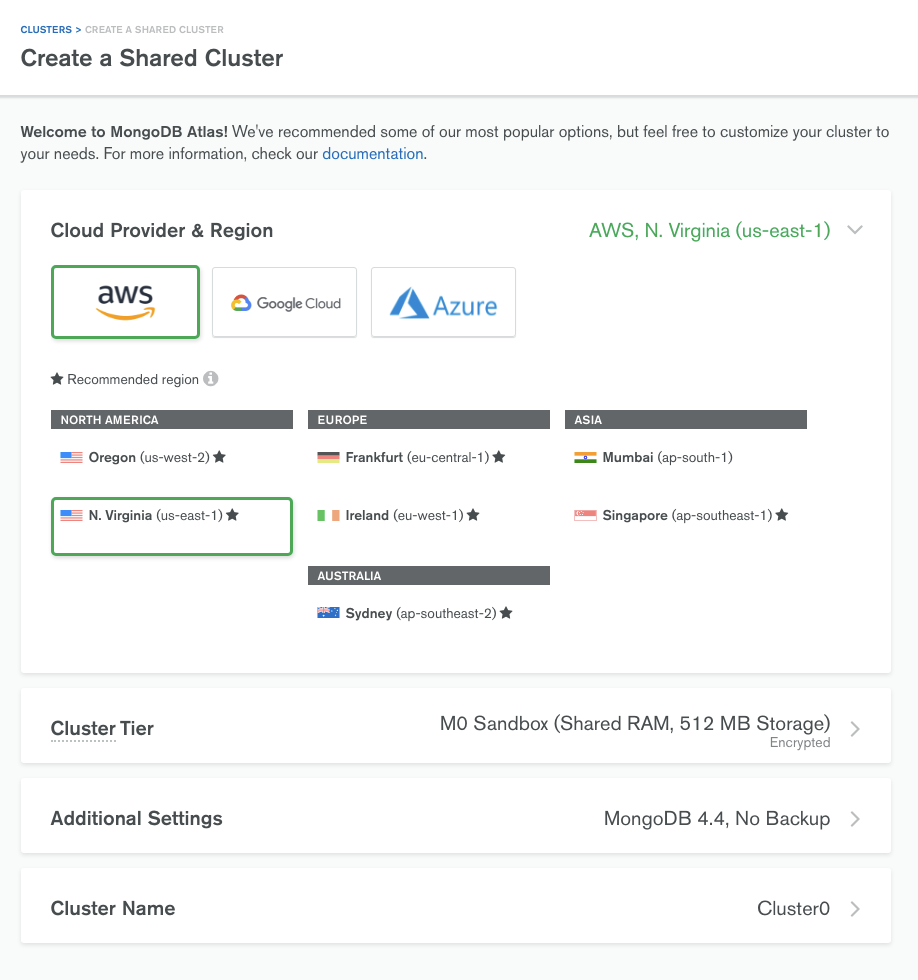
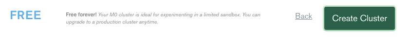

## Deploying an Atlas Cluster

Create an Account or Log In to [Atlas](https://cloud.mongodb.com).

We’ll be using MongoDB Atlas, our fully managed Database as a Service, for this workshop. Go to [https://cloud.mongodb.com](https://cloud.mongodb.com) and either create a new account or log into an existing account you may have previously created. Create a new Atlas project to use in this workshop.

*Note that the Atlas team sometimes experiment with the UI to make things more intuitive – that means that your experience might not match what you see here.*

### Create a Free Tier Cluster
#### Click Build a Cluster

Opt to create a "Shared Cluster" so that you can use the free tier:

Take a moment to browse the options (Provider & Region, Cluster Tier, Version, Backup, …):

Make sure that you opt for the "M0" free-tier.

Leave the remaing options set to the defaults and skip down to the bottom section where you can set the Cluster Name.

Set the Cluster Name - This can be whatever you like.

Now, click create to create the cluster: 

Next, you will see your cluster with a blue banner along the top indicating that changes are being deployed. This will take aa couple minutes to complete the provisioning process:

