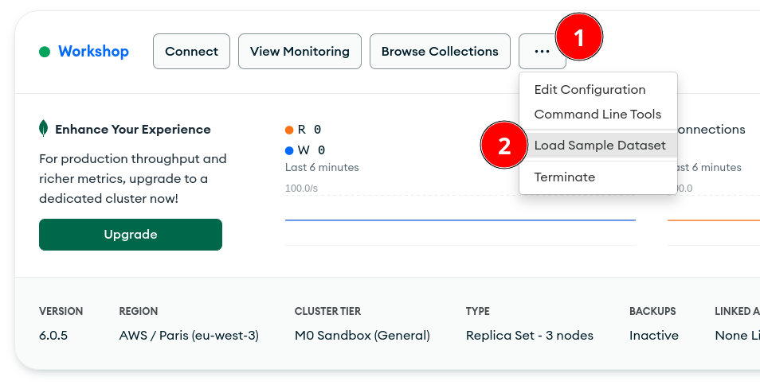
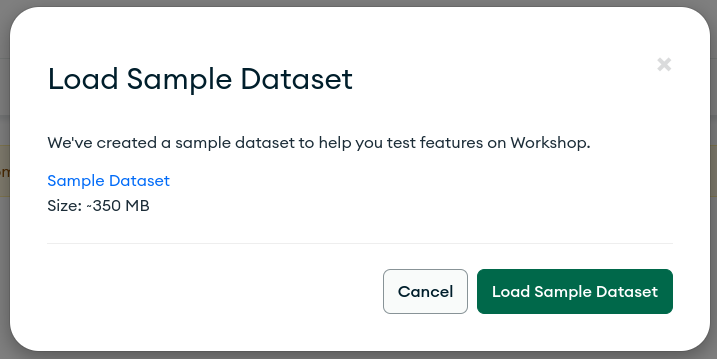

## Load Sample Datasets

MongoDB Atlas comes complete with sample datasets that can be loaded into your cluster right from the web administrative interface.

To load the sample dataset:

- navigate to the Data Services tab,
- locate the ellipsis button corresponding to your new M0 cluster,
- select `Load Sample Dataset`.

Confirm:

Once loaded, check out your sample data by click your cluster’s `Browse Collections` button. 

You should see the following databases in your cluster:

- sample_airbnb
- sample_analytics
- sample_geospatial
- sample_guides
- sample_mflix
- sample_restaurants
- sample_supplies
- sample_training
- sample_weatherdata

For details on the collections and documents included in these datasets, see [Sample Datasets for Atlas Clusters](https://docs.atlas.mongodb.com/sample-data/).

You can now head to [Configure Security](../03-Configure-Security) section.
