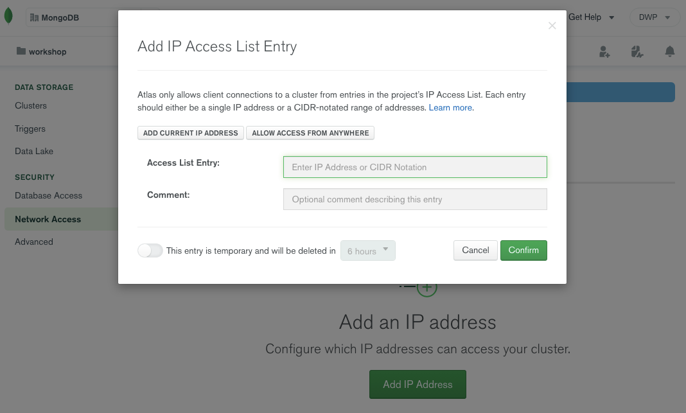
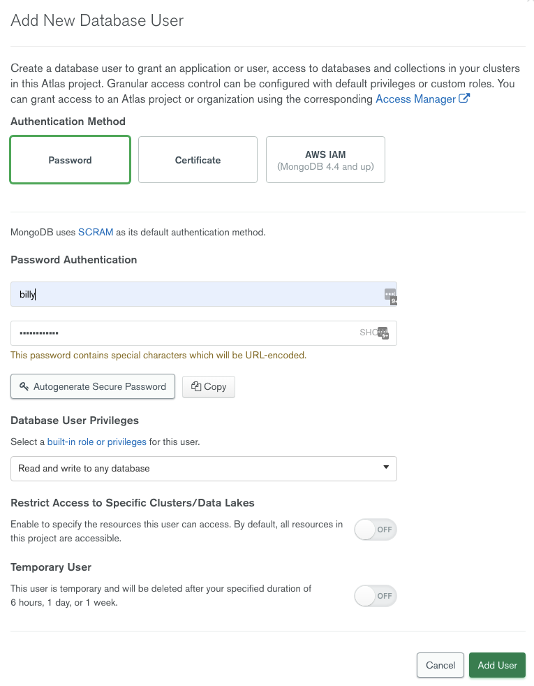

## Security Configuration

Atlas only allows client connections to the cluster from entries in the project’s IP access list. Each entry is either a single IP address or a CIDR-notated range of addresses. 

MongoDB Atlas uses several mechanisms to ensure the security of your databases and collections. This section will walk you through the process of configuring these options.

### IP Access List

To add an entry to the IP access list, from the Clusters view, select "Network Access" under Security in the left-hand menu, then Add IP Address. Atlas supports creating temporary IP entries that automatically expire within a user-configurable 7-day period:

Use the convenient `ADD CURRENT IP ADDRESS` button to automatically add your current IP Address to the list of whitelisted addresses.

### User Authentication

Create MongoDB users (`Security/Database Access`) to provide clients access to the clusters in your project. A MongoDB user’s access is determined by the roles assigned to the user. When you create a MongoDB user, the user is added to all clusters in your Atlas project.

MongoDB users are separate from users of the Atlas UI/API. MongoDB users have access to MongoDB databases, while Atlas users have access to the Atlas application itself. Atlas supports creating temporary MongoDB users that automatically expire within a user-configurable 7-day period.

Next, we'll navigate back `ATLAS/Clusters` on your cluster management console.

Now, click the `CONNECT` button to see various ways to access your database – you don't need to do anything at this point.
