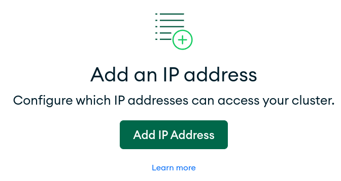

## Security Configuration

Atlas only allows client connections to the cluster from entries in the project’s IP access list. Each entry is either a single IP address or a CIDR-notated range of addresses. 

MongoDB Atlas uses several mechanisms to ensure the security of your databases and collections. This section will walk you through the process of configuring these options.

> Note that you might have a `Quickstart` option in the menu if you are new to Atlas. Feel free to use it, but we'll cover the usual path below.

### IP Access List

To add an entry to the IP access list, select "Network Access" under `SECURITY` in the left-hand menu, then Add IP Address. Atlas supports creating temporary IP entries that automatically expire within a user-configurable 7-day period.

Use the convenient `ADD CURRENT IP ADDRESS` button to automatically add your current IP Address to the list of whitelisted addresses.

### User Authentication

Let's now create a MongoDB user (`Security/Database Access`) to provide client access to the clusters in your project. A MongoDB user’s access is determined by the roles assigned to the user.

MongoDB users are separate from users of the Atlas UI & API.

Database users have access to MongoDB databases (clusters), while Atlas users have access to the Atlas application itself. Atlas supports creating temporary MongoDB users that automatically expire within a user-configurable 7-day period.

You can now navigate back to the `Data Services` page. You should see your IP address and new user being deployed by MongoDB Atlas.

Now, click the `CONNECT` button to see various ways to access your database – you don't need to do anything at this point.

Well done!

You can now continue the workshop by selecting the [relevant branch in GitHub](https://github.com/mongodb-developer/workshop/branches).
