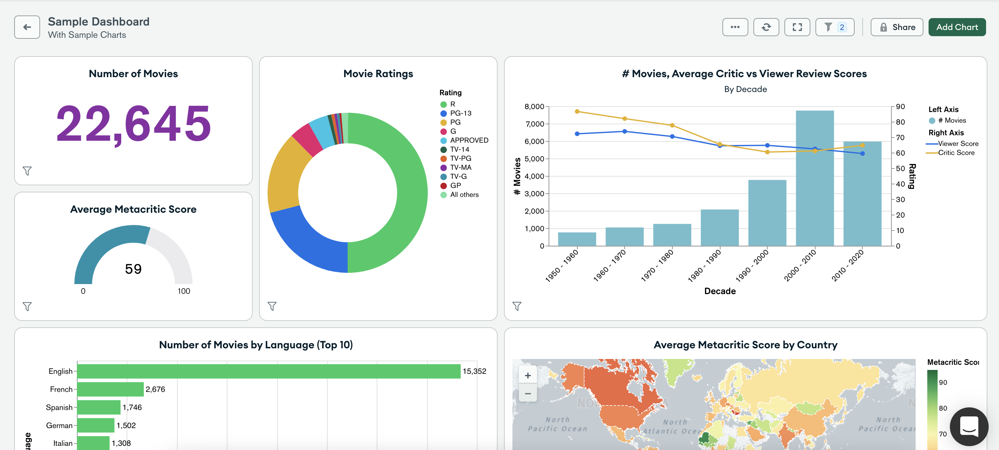
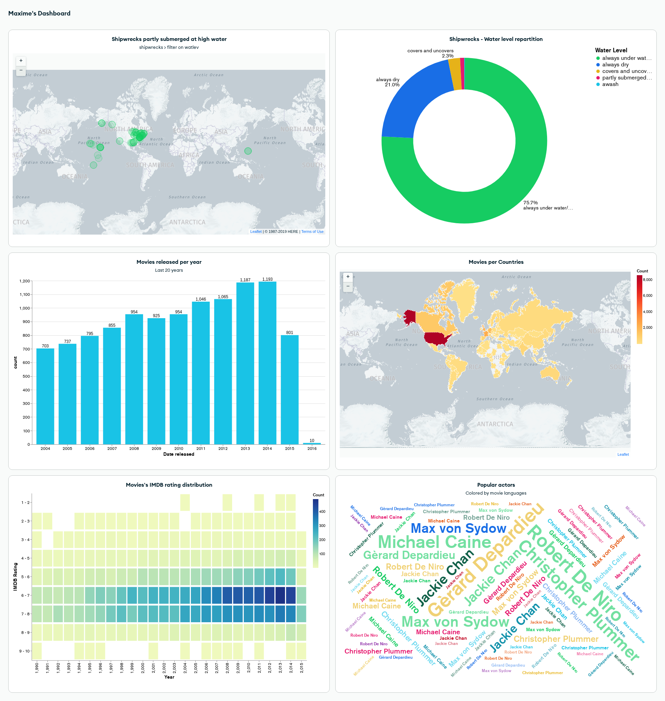
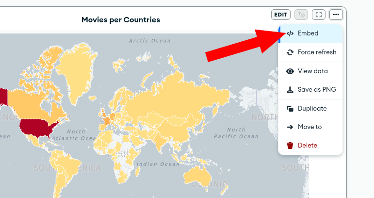

# MongoDB Charts Workshop

[MongoDB Charts](https://www.mongodb.com/products/charts) is a modern data visualization tool that allows you to easily
create, share, and embed visualizations from MongoDB Atlas.

In this workshop, you'll discover MongoDB Charts with the support of your instructor and
the [documentation](https://www.mongodb.com/docs/charts/).

MongoDB Charts is a very visual tool, so the best way to master it is by using it.

Using the sample data sets, try to
reproduce [this dashboard](https://charts.mongodb.com/charts-charts_workshop_maxime-afhyw/public/dashboards/64aa1d8f-904b-4d2d-8c96-87a9d4b5aed5).

You'll need to use the collections:

- `sample_geospatial.shipwrecks`
- `sample_mflix.movies`

If you are stuck, call your instructor :-) !

If you are done, try to share this dashboard publicly like I did for the link above.

How can you embed a single chart in a webpage?

Can you produce a new chart that your instructor couldn't even imagine while building his dashboard ? :-)
