# MongoDB Atlas - REST & GraphQL APIs

In this workshop, you'll learn how to create a REST API and a GraphQL API to interact with the data stored in your
MongoDB Atlas cluster.

As security is important, you'll also test these APIs to understand how you can consume them safely.

This workshop assumes that you have already completed
the [MongoDB Atlas tutorial](https://github.com/mongodb-developer/workshop/tree/atlas). To follow along, you'll need
access to your Atlas cluster with the sample data set.

## REST API

MongoDB Atlas offers 2 options to create a serverless REST API:

- The [Data API](https://www.mongodb.com/atlas/app-services/data-api) allows you to create a serverless REST API with
  just a few clicks.
- The [Custom HTTPS Endpoints](https://www.mongodb.com/docs/atlas/app-services/data-api/custom-endpoints/) allows you to
  create app-specific API routes or webhooks that integrate with external services. A custom endpoint uses a serverless
  function that you write to handle incoming requests for a specific URL and HTTP method.

### The Data API - Set up

Let's test the Data API first.

- Click on the Data API tab.

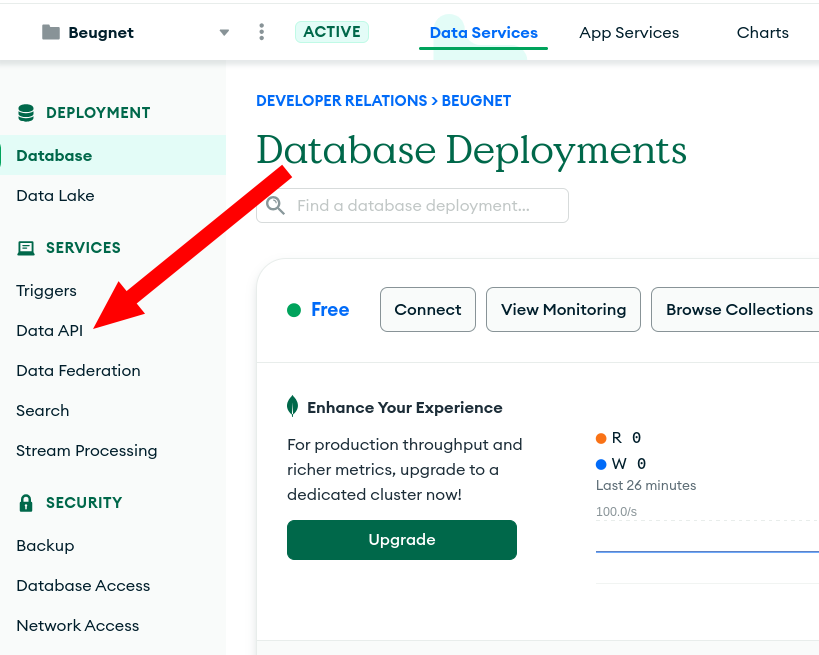

- Then you can enable the Data API.
- Note that in order to reduce the latency between the Data API and your Atlas cluster, you should try to deploy in a
  region close to your Atlas cluster. Here my cluster is in Dublin, so I'm deploying it in Dublin as well.

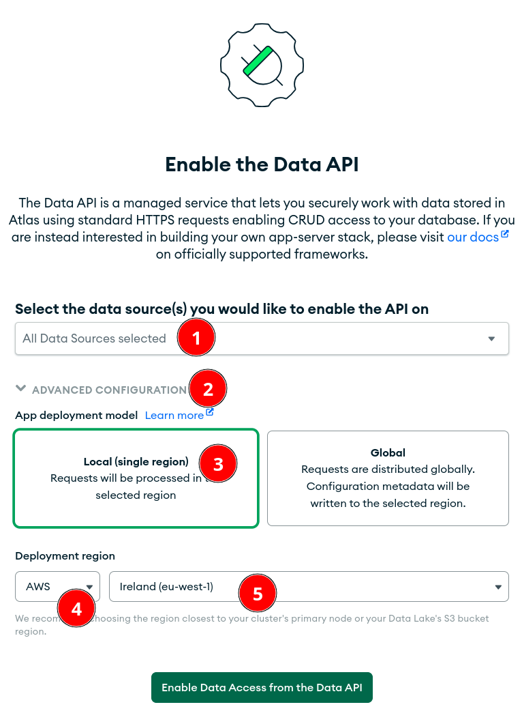

- By default, Data API is secured with an API key system.
- You can switch to a different authentication system in the associated serverless application later if you want.
- Let's pick a name for your API key.

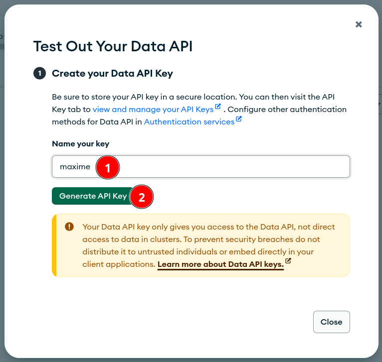

- **Save your API key**. Else you'll need to recreate a new one.
- The UI generates a valid cURL query with the API key for you to test this API.

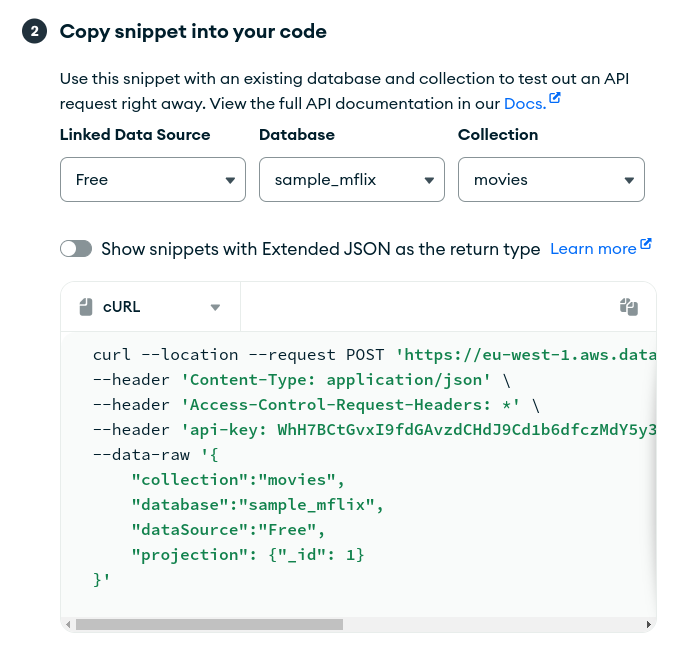

### The Data API - Testing

- As you can see, there is a [projection](https://www.mongodb.com/docs/manual/reference/method/db.collection.find/#std-label-find-projection), so it only returns the `_id` fields of the document. Try to remove it to display the entire document.
- Using the [Data API Resources documentation](https://www.mongodb.com/docs/atlas/api/data-api-resources/), can you craft a cURL to:
  - insert a new document
  - find in the `sample_mflix.movies` collection which *year* the movie "The Matrix" was released?

Note: If you have python installed, you can pretty print JSON by piping the result of the cURL command to `python -m json.tool`

### HTTPS Custom Endpoints - Set up

OK so, now, you have a REST API that allow you to interact with the data in your Atlas cluster.

But what if you need more logic in your REST API? What if you need to call a 3rd party API to build your answer?

To achieve this, you can use HTTPS Endpoints which execute a JavaScript function when called.

- Let's navigation in our serverless application in the App Services tab.

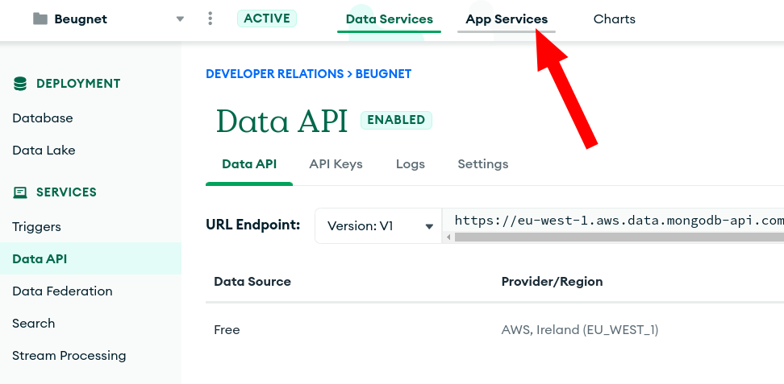

- When you activated the Data API, Atlas created a serverless application for you automatically to host your REST application.

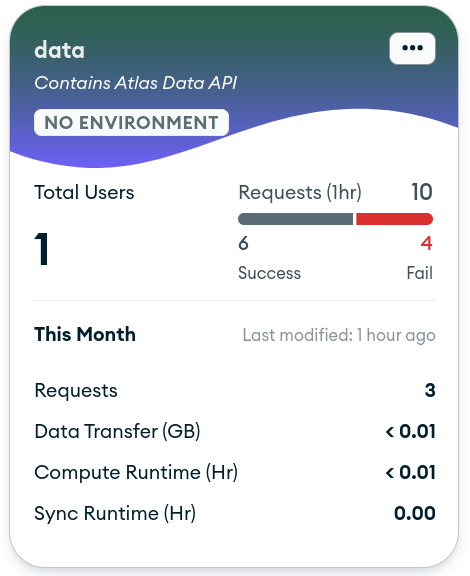

- Inside this application, you can access the Data API we created earlier.

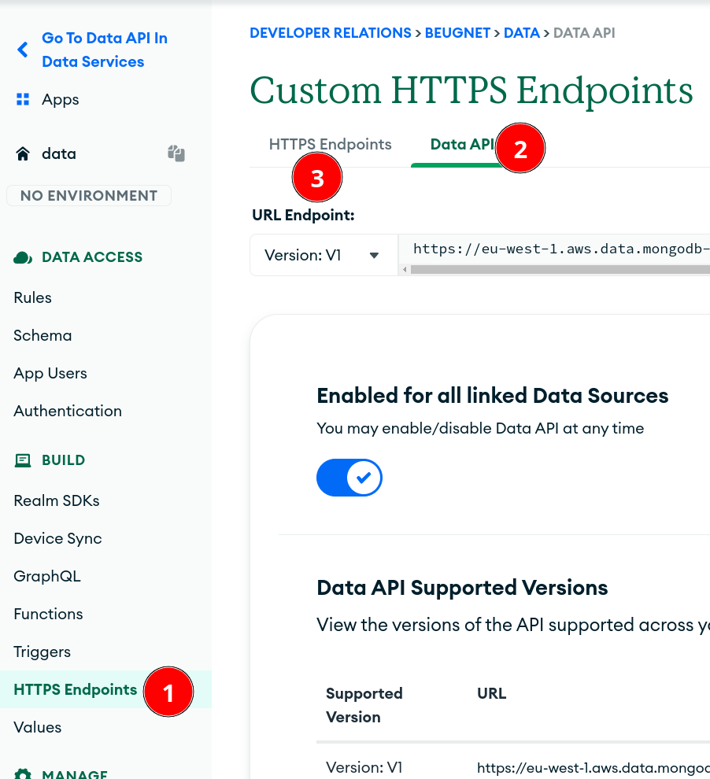

- If you check the authentication tab, you'll also see that the `API Keys` provider was also activated already for the Data API.

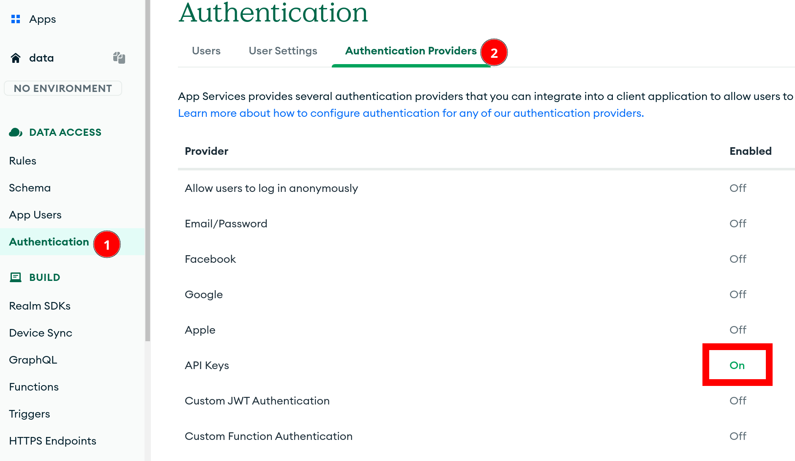

- Now let's create a simple HTTPS endpoint that does something that the Data API cannot do.
- Let's create an HTTPS POST endpoint that saves a document in a MongoDB collection and adds a field `insertAt: new Date()`.
- Go to the HTTPS Endpoints tab and create a new endpoint.

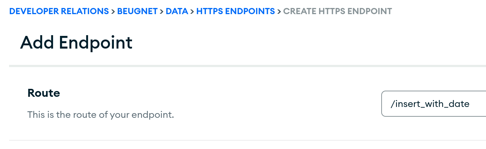

- When your HTTPS endpoint is called, it's going to start a serverless function which needs to be created.

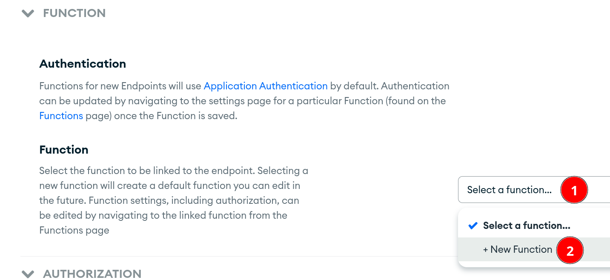

- Name your function and use the following code: 

```js
exports = function({ query, headers, body}, response) {
  // access our MongoDB Atlas cluster
  const atlas = context.services.get("Free"); // Update with the name of your cluster
  const coll = atlas.db("test").collection("users");

  // get the doc from the body and add date
  let doc = JSON.parse(body.text());
  doc.insertedAt = new Date();

  // insert in our collection
  coll.insertOne(doc).then(res => {
    response.setBody(JSON.stringify(res));
  });
};
```

- Save your endpoint and navigate back to it to retrieve the cURL command.
- It should look like this: 

```shell
curl \
-H "Content-Type: application/json" \
-d '{"foo":"bar"}' \
https://eu-west-1.aws.data.mongodb-api.com/app/data-abcde/endpoint/insert_with_date
```

- Note that the URL endpoint is unique to your project as it contains a unique APPID: `data-abcde`.
- Try to execute your cURL command...
- Remember when I said security is important?
- Just like the Data API, we can use our user API key. Add your API key header and try again.

```shell
curl \
-H "Content-Type: application/json" \
-d '{"foo":"bar"}' \
-H "apiKey: YOUR_API_KEY_HERE" \
https://eu-west-1.aws.data.mongodb-api.com/app/data-abcde/endpoint/insert_with_date
```

- Navigate to your collection to confirm that the document was saved with the extra date field.

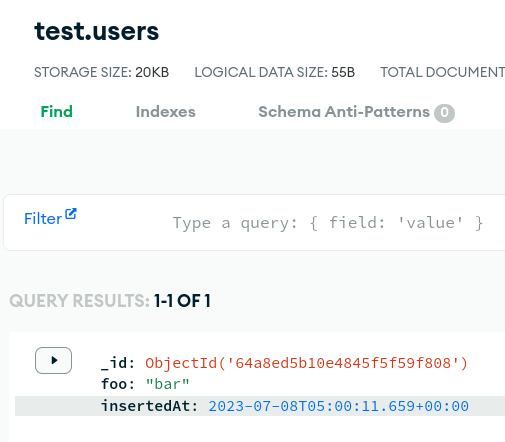

- Of course, our JavaScript function can do much more than that.
  - send HTTP requests,
  - connect to external services,
  - use NPM dependencies,
  - run multiple MongoDB queries,
  - implement some complex business logic,
  - ...

## GraphQL API