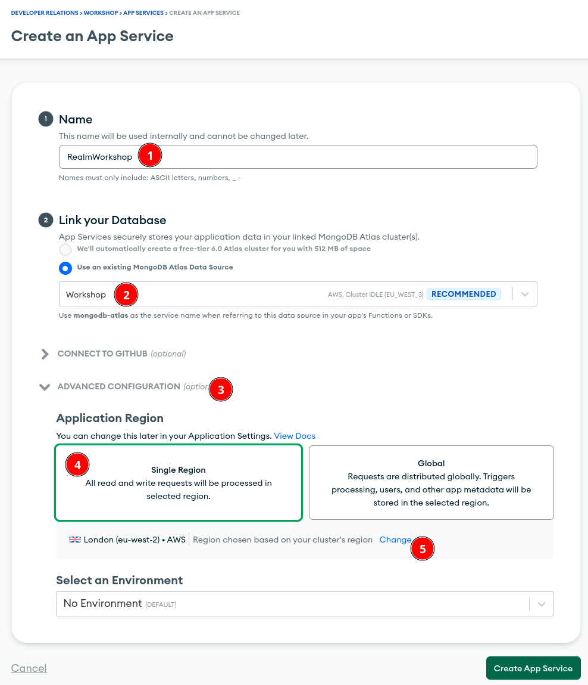
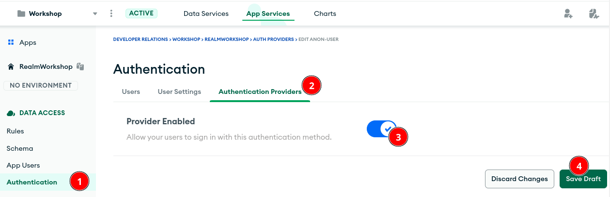
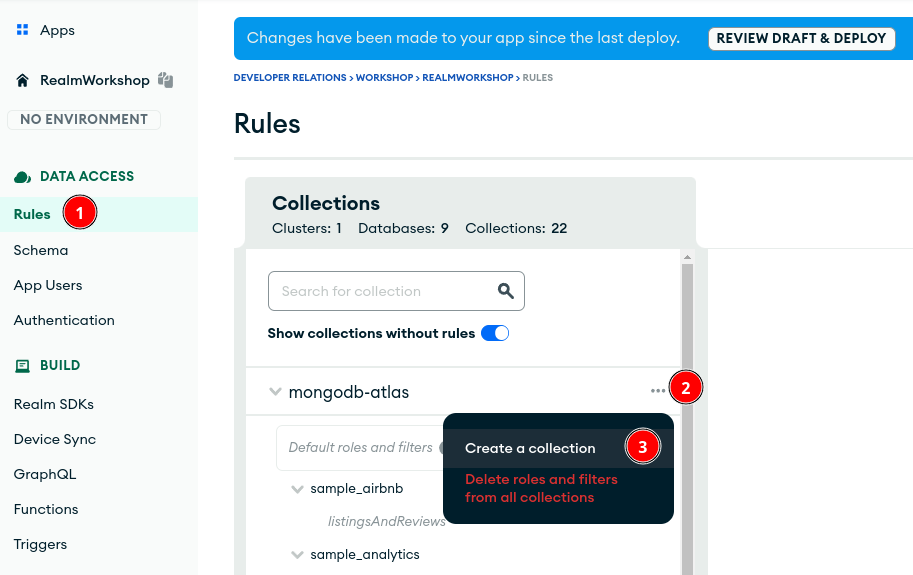
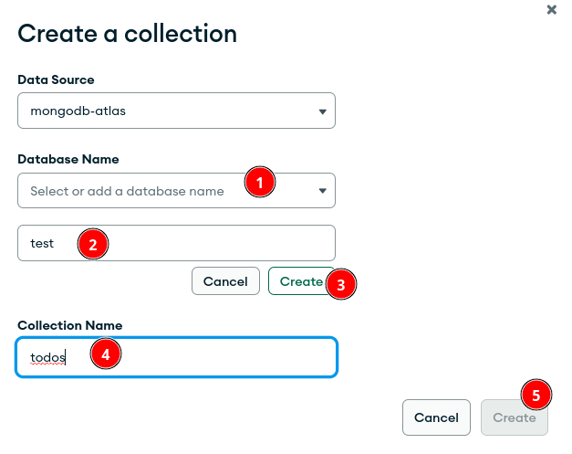
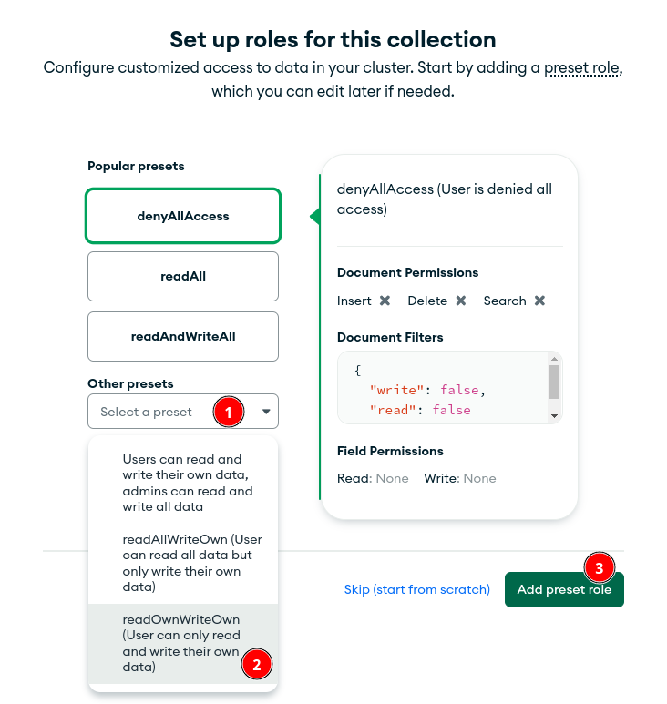
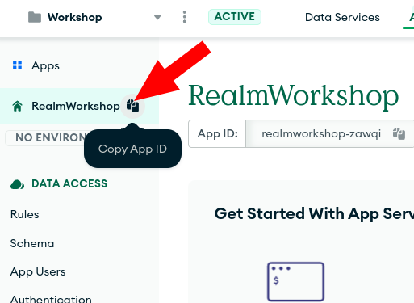
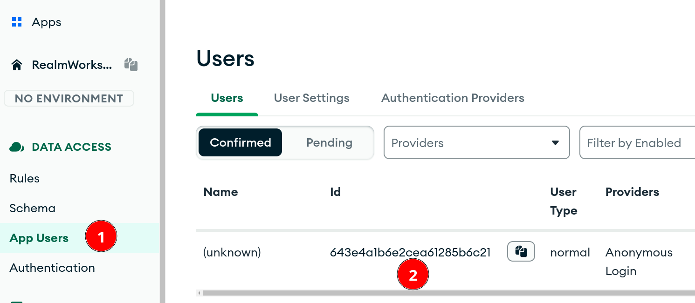

# MongoDB Realm Web SDK

In this workshop, you will learn how to interact with data from a MongoDB Atlas cluster using the [MongoDB Realm Web SDK](https://docs.mongodb.com/realm/web/) and display it into a simple website.

The goal is to create a simple TODO list website that stores data into our MongoDB cluster.

## Prerequisites

- You need an Atlas cluster. See the [Atlas branch](https://github.com/mongodb-developer/workshop/tree/atlas) for more details.
- [Option 1 - easier] Access to the website https://jsfiddle.net/ for the website.
- [Option 2 - more steps] Host the website locally with `python3 -m http.server` or equivalent.

## Lab: Create a MongoDB App Services Application

- Access App Services by clicking the link at the top in your MongoDB Atlas UI, above your cluster.


- Create an application. If possible, keep it close (same region) to your Atlas Cluster to reduce the latency.



- Our Realm Web SDK needs to authenticate users to work properly. In this tutorial, we will use the [anonymous authentication](https://www.mongodb.com/docs/atlas/app-services/authentication/anonymous/) to keep it simple.



- We need to tell to our application what our authenticated users can do with each collection.
- In this case, we want them to access the `test.todos` collection.
- Each user should be able to read and write their own data without interfering with other people's todo list.




- Then click on `Add role` and add the ReadOwnWriteOwn rule on this collection.



- And we are done! Now we need to deploy all these modifications.


- Take a moment to explore the features of MongoDB App Services.
- Note that you can: 
  - [Manage users](https://www.mongodb.com/docs/atlas/app-services/users/) with different [authentication options](https://www.mongodb.com/docs/atlas/app-services/authentication/#std-label-authentication-providers),
  - [Sync data across mobile devices](https://www.mongodb.com/docs/atlas/app-services/sync/),
  - Create [HTTPS endpoints](https://www.mongodb.com/docs/atlas/app-services/data-api/custom-endpoints/#std-label-https-endpoints),
  - Create a [GraphQL API](https://www.mongodb.com/docs/atlas/app-services/graphql/), 
  - Create [triggers](https://www.mongodb.com/docs/atlas/app-services/triggers/) and [functions](https://www.mongodb.com/docs/atlas/app-services/functions/), 
  - ... and much more!

## Lab: Create a mini website with the Realm Web SDK

Now that our Realm application is ready, let's create our website.

- Open https://jsfiddle.net/
- Copy & paste the following files in the corresponding code blocks.

### HTML 

```html
<!DOCTYPE html>
<html lang="en">

<head>
    <link rel="shortcut icon" type="image/png" href="https://www.mongodb.com/assets/images/global/favicon.ico"/>
    <script src="https://unpkg.com/realm-web/dist/bundle.iife.js"></script>
    <script src="https://ajax.googleapis.com/ajax/libs/jquery/3.6.4/jquery.min.js"></script>
    <title>My Todos List</title>
</head>

<body>
<h1>My Todo List</h1>
<div>
    <!-- Login anonymously -->
    <input type="submit" value="LOGIN" onClick="login()">
    <!-- Finds todos in todos collection -->
    <input type="submit" value="FIND" onClick="find_todos()">
</div>

<form id="todoForm" onsubmit="return false;">
    <label for="taskInput">Task:</label>
    <input type="text" id="taskInput" name="task" required>
    <button type="submit" onclick="insert_todo()">Add</button>
    <button type="submit" onclick="toggle_todo()">Toggle</button>
    <button type="submit" onclick="delete_todo()">Delete</button>
</form>

<!-- Using this div to display the user ID -->
<div id="user">
    <p>User ID: <span id="userid"></span></p>
</div>
<!-- Using this div to show the todos -->
<div id="todos"></div>
</body>

</html>
```

### JavaScript

```js
const APP_ID = '<YOUR-APPID>';
const ATLAS_SERVICE = 'mongodb-atlas';
const app = new Realm.App({id: APP_ID});

let user_id = null;
let mongodb = null;
let coll = null;

// Function executed by the LOGIN button.
const login = async () => {
    const credentials = Realm.Credentials.anonymous();
    try {
        const user = await app.logIn(credentials);
        $('#userid').empty().append(user.id); // update the user div with the user ID
        user_id = user.id;
        mongodb = app.currentUser.mongoClient(ATLAS_SERVICE);
        coll = mongodb.db("test").collection("todos");
    } catch (err) {
        console.error("Failed to log in", err);
    }
};

// Function executed by the INSERT button.
const insert_todo = async () => {
    console.log("INSERT");
    const task = $('#taskInput').val();
    await coll.insertOne({task, status: false, owner_id: user_id});
    find_todos();
}

const toggle_todo = async () => {
    console.log("TOGGLE");
    const task = $('#taskInput').val();
    const todo = await coll.findOne({task, owner_id: user_id});
    await coll.updateOne({"_id": todo._id, owner_id: user_id}, {"$set": {"status": !todo.status}});
    find_todos();
}

const delete_todo = async () => {
    console.log("DELETE");
    const task = $('#taskInput').val();
    await coll.deleteOne({task, owner_id: user_id});
    find_todos();
}

// Function executed by the "FIND" button.
const find_todos = async () => {
    if (mongodb == null || coll == null) {
        $("#userid").empty().append("Need to login first.");
        console.error("Need to log in first", err);
        return;
    }

    // Retrieve todos
    const todos = await coll.find({}, {
        "projection": {
            "_id": 0,
            "task": 1,
            "status": 1
        }
    });

    console.log(todos);

    // Access the todos div and clear it.
    let todos_div = $("#todos");
    todos_div.empty();

    // Loop through the todos and display them in the todos div.
    for (const todo of todos) {
        let p = document.createElement("p");
        p.append(todo.task);
        p.append(" => ");
        p.append(todo.status ? "Done!" : "TODO!");
        todos_div.append(p);
    }
};
```

- In order to connect our website to our application in MongoDB App Services, we need to provide the App ID.
- The first line of your JavaScript needs your [App ID](https://www.mongodb.com/docs/atlas/app-services/apps/metadata/). You can find it here:



In my case, my first line looks like this at this point but please use your own APPID:

```js
const APP_ID = 'realmworkshop-zawqi';
```


### CSS (optional)

```css
body {
    font-family: sans-serif;
    margin: 0;
    padding: 0;
    background-color: #F6F8FA;
}

h1 {
    font-size: 2.5em;
    text-align: center;
    margin-top: 1em;
}

div {
    display: flex;
    justify-content: center;
    margin: 1em 0;
}

input[type="submit"],
button[type="submit"] {
    background-color: #666;
    border: none;
    color: white;
    padding: 0.5em 1em;
    margin: 0 0.5em;
    border-radius: 4px;
    cursor: pointer;
}

input[type="submit"]:hover,
button[type="submit"]:hover {
    background-color: #444;
}

form {
    display: flex;
    justify-content: center;
    margin-top: 1em;
}

label {
    font-weight: bold;
    margin-right: 0.5em;
}

label {
    display: inline-block;
    vertical-align: middle;
    line-height: 34px;
    margin-right: 10px;
}


input[type="text"] {
    border: 1px solid #ccc;
    padding: 0.5em;
    font-size: 1em;
    border-radius: 4px;
    margin-right: 0.5em;
}

#todos {
    display: block;
    margin: 2em;
    max-width: 800px;
}

p {
    display: block;
    margin: 0;
    padding: 5px;
}

#user p {
    font-weight: bold;
}
```

## Lab: Website in Action

At this point, your website should be working. Explore the code to understand how this website works.

- Click on "LOGIN". You are now authenticated with an anonymous user.


- You can find this user in your application in the `App Users` menu.



- Explore the JavaScript functions and see how the SDK communicates with the App Services serverless back-end to achieve your MongoDB queries.


> Try removing or changing the rule on the `test.todos` collection in your application and see the effect in the website.

## Lab: Add features to the Website!

But before you go, can you add some features to the website?

Here are a few ideas: 
- Sort the list of todos in alphabetical order.
- Make it possible to edit a todo.
- Add a button to delete all the todos.
- Replace the anonymous login by email & password login.

Congratulations! You reached the end of the workshop.

# Conclusion

In this workshop, you learned how to set up your first website using MongoDB Realm Web SDK. 

MongoDB App Services provides [a number of SDKs](https://docs.mongodb.com/realm/sdk/) that can also be useful for your project:

- [Java SDK](https://www.mongodb.com/docs/realm/sdk/java/)
- [Swift SDK](https://www.mongodb.com/docs/realm/sdk/swift/)
- [Node.js SDK](https://www.mongodb.com/docs/realm/sdk/node/)
- [.NET SDK](https://www.mongodb.com/docs/realm/sdk/dotnet/)
- [React Native SDK](https://www.mongodb.com/docs/realm/sdk/react-native/)
- [Kotlin SDK](https://www.mongodb.com/docs/realm/sdk/kotlin/)
- [Web SDK](https://www.mongodb.com/docs/realm/web/)
- [Flutter SDK](https://www.mongodb.com/docs/realm/sdk/flutter/)

If you have any question, please reach out on the [MongoDB Community Forum in the Realm SDKs category](https://developer.mongodb.com/community/forums/c/realm-sdks/58).

# Author

Maxime Beugnet <maxime@mongodb.com>
