# MongoDB Realm Web SDK

In this workshop, you will learn how to retrieve data from a MongoDB Atlas cluster using the [MongoDB Realm Web SDK](https://docs.mongodb.com/realm/web/) and display it into a website hosted in [MongoDB Realm Static Hosting](https://docs.mongodb.com/realm/hosting/).

## Prerequisites

- You need an Atlas cluster loaded with the sample data sets. See the [Atlas branch](https://github.com/mongodb-developer/workshop/tree/atlas) for more details.

## Lab: Create a Realm Application

- Access Realm by clicking the link at the top in your MongoDB Atlas UI, above your cluster.

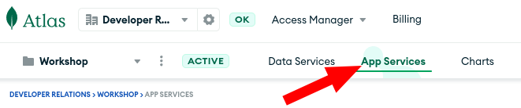

- Create a Realm application. If possible, keep it close (same region) to your Atlas Cluster.

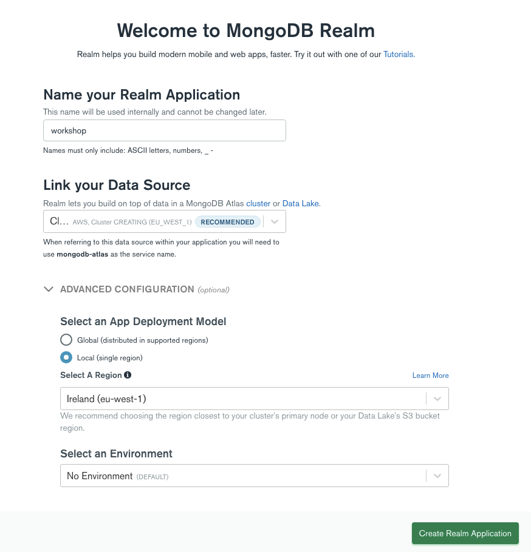

- Our Realm Web SDK needs to authenticate users to work properly. In this tutorial, we will use the [anonymous authentication](https://docs.mongodb.com/realm/authentication/anonymous/) to keep it simple.

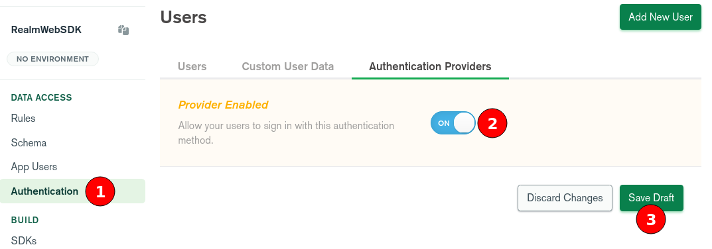

- We need to tell to our Realm Application what our authenticated users can do with each collection. In this case, we want them to access the `sample_mflix.movies` collection in read-only.

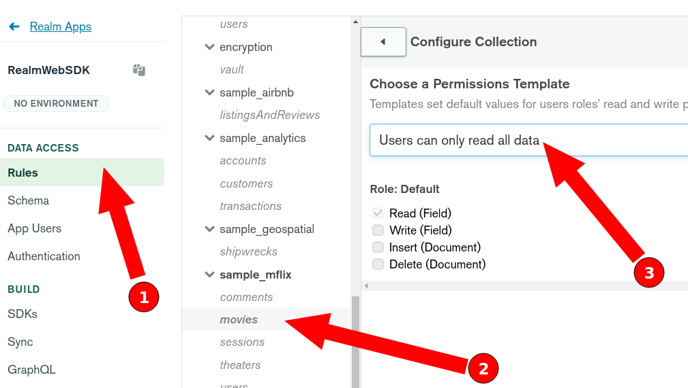

- Don't forget to click on "Configure Collection" to validate this choice.
- You also need to deploy these modifications.

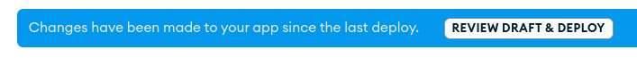

## Lab: Create a mini website with the Realm Web SDK

Now that our Realm application is ready, we can create a mini website to retrieve 20 movies titles from our `sample_mflix.movies` collection in MongoDB Atlas and display them in our website.

- Create a new folder and a new file `index.html`.

```html
<!DOCTYPE html>
<html lang="en">
<head>
  <link rel="shortcut icon" type="image/png" href="https://www.mongodb.com/assets/images/global/favicon.ico"/>
  <script src="https://unpkg.com/realm-web@1.2.0/dist/bundle.iife.js"></script>
  <script src="https://ajax.googleapis.com/ajax/libs/jquery/3.6.0/jquery.min.js"></script>
  <title>My Movie Titles</title>

</head>

<body>
<h1>My Movies</h1>

<div>
  <input type="submit" value="LOGIN" onClick="login()">
  <input type="submit" value="FIND 20 MOVIES" onClick="find_movies()">
</div>

<div id="user"></div>

<div id="movies"></div>

<script src="data.js"></script>

</body>
</html>
```

- In the same folder, create a file `data.js`.

```js
const APP_ID = '<YOUR_REALM_APPID>';
const ATLAS_SERVICE = 'mongodb-atlas';
const app = new Realm.App({id: APP_ID});

const login = async () => {
  const credentials = Realm.Credentials.anonymous();
  try {
    const user = await app.logIn(credentials);
    $('#user').empty().append("User ID: " + user.id);
  } catch (err) {
    console.error("Failed to log in", err);
  }
};

const find_movies = async () => {
  let collMovies;
  try {
    const mongodb = app.currentUser.mongoClient(ATLAS_SERVICE);
    collMovies = mongodb.db("sample_mflix").collection("movies");
  } catch (err) {
    $("#user").append("Need to login first.");
    console.error("Need to log in first", err);
    return;
  }

  const movies_titles = await collMovies.find({}, {
    "projection": {
      "_id": 0,
      "title": 1
    },
    "limit": 20
  });
  let movies_div = $("#movies");
  movies_div.empty();
  for (const movie of movies_titles) {
    let p = document.createElement("p");
    p.append(movie.title);
    movies_div.append(p);
  }
};
```

- The first line of `data.js` needs your [Realm APPID](https://docs.mongodb.com/realm/get-started/find-your-project-or-app-id/). You can find it here:

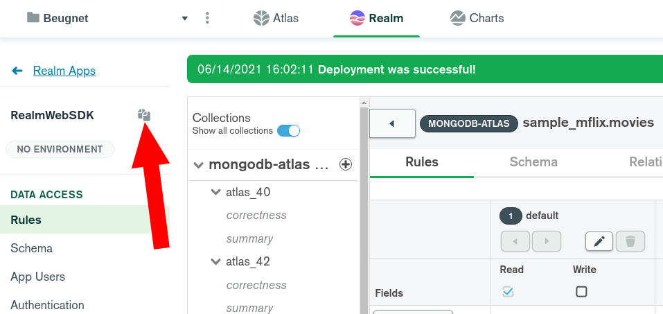

In my case, my first line looks like at this point but please use your own APPID: 

```js
const APP_ID = 'realmwebsdk-uuldw';
```

## Lab: Deploy the Website in MongoDB Realm Static Hosting

- Back in the Realm UI, enable the Hosting feature.

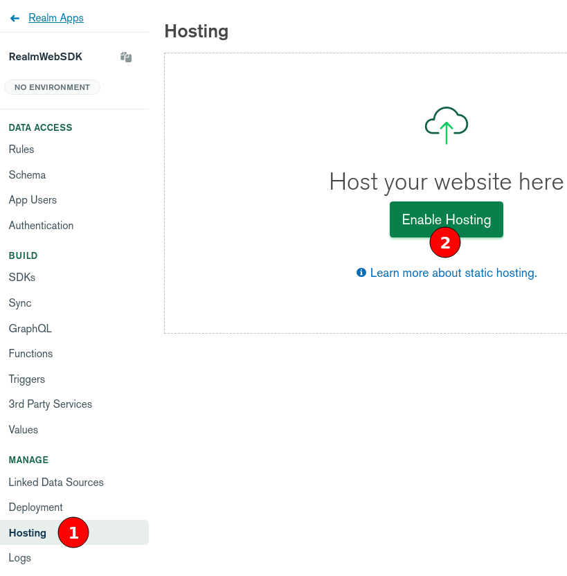

- Upload your two files `index.html` and `data.js` using the `UPLOAD FILES` button. Realm will tell you that you are overwriting `./index.html`. This is expected of course. This is the expected result.

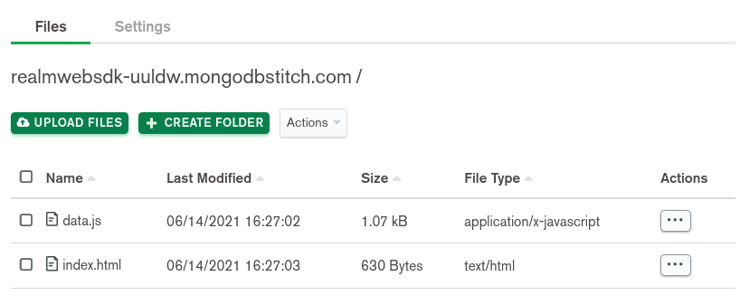

- Don't forget to review and deploy your modification!


- At this point, you *should* be able to access your website with the provided link, but the DNS can take up to 15 minutes to propagate.

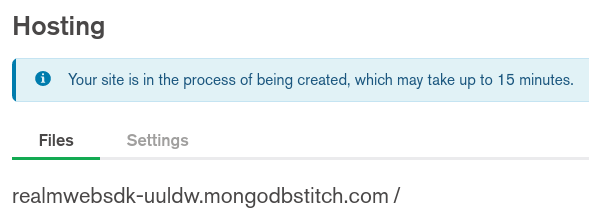

- Try to open the provided link and if that doesn't work yet, feel free to open your local `index.html` file in your preferred web browser, you should see something like this:

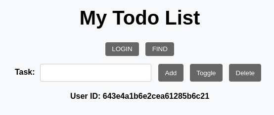

- Click on "LOGIN". You are now authenticated with an anonymous user.

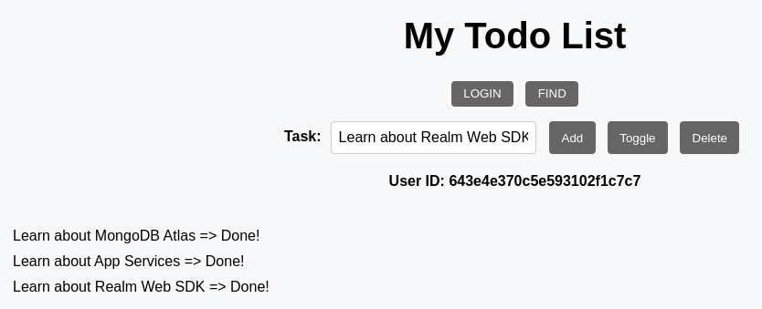

- You can find this user in your Realm Application in the `App Users` menu.

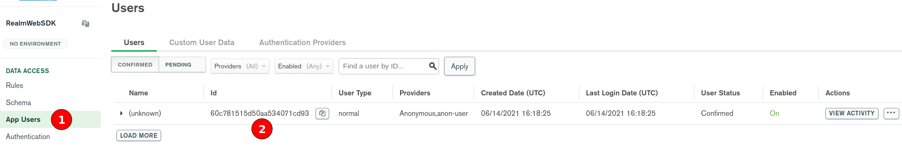

- If you click on the "FIND 20 MOVIES" button, you should now see a bunch of movie titles that come from your MongoDB Atlas sample collection.

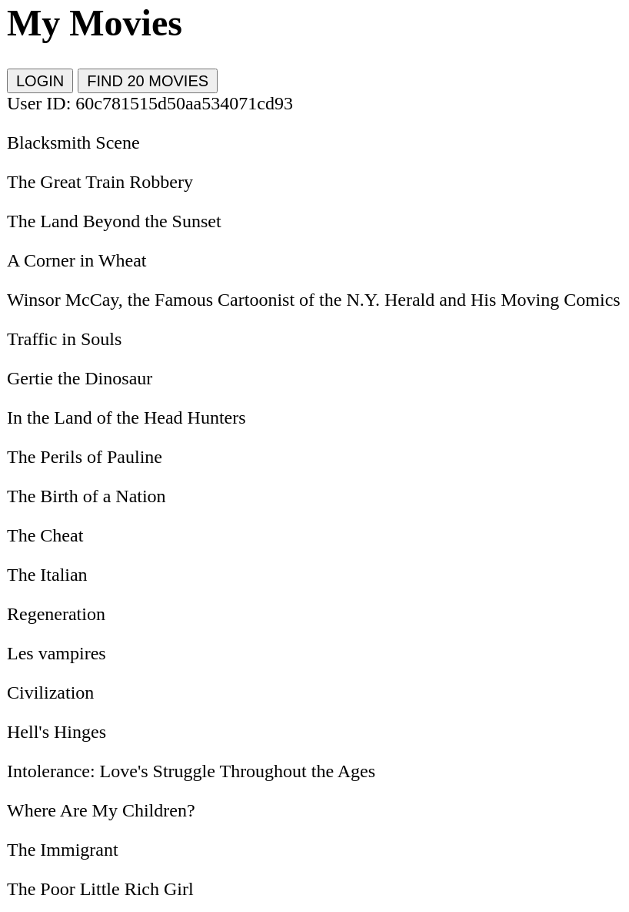

# Conclusion

In this workshop, you learned how to set up your first website using MongoDB Realm Web SDK. 

MongoDB Realm provides [a number of SDKs](https://docs.mongodb.com/realm/sdk/) that can also be useful for your project:

- [Android SDK](https://docs.mongodb.com/realm/sdk/android/)
- [iOS SDK](https://docs.mongodb.com/realm/sdk/ios/)
- [.NET SDK](https://docs.mongodb.com/realm/sdk/dotnet/)
- [Node.js SDK](https://docs.mongodb.com/realm/sdk/node/)
- [React Native SDK](https://docs.mongodb.com/realm/sdk/react-native/)
- [Web SDK](https://docs.mongodb.com/realm/web/)

If you have any question, please reach out on the [MongoDB Community Forum in the Realm SDKs category](https://developer.mongodb.com/community/forums/c/realm-sdks/58).

# Author

Maxime Beugnet <maxime@mongodb.com>
