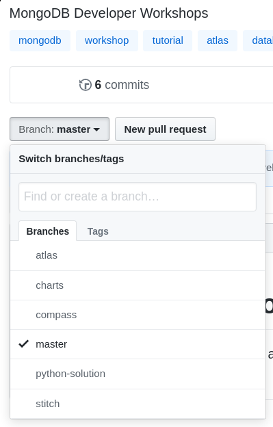

# MongoDB Developer Workshops

This repository contains MongoDB Workshop modules. Each of them lives in a branch in this repository.

In this README, you will find information about each workshop.

Always start with the [Atlas Workshop](https://github.com/mongodb-developer/workshop/tree/atlas). Then you can do any of the other workshop.

## Modules

To navigate from one branch to another, you can use the `branch` button in this Github repository.

- The [atlas](https://github.com/mongodb-developer/workshop/tree/atlas) workshop will teach you
  - how to set up a [MongoDB Atlas](https://www.mongodb.com/cloud/atlas/) free tier cluster,
  - how to set up the security to access your cluster,
  - how to import the sample data sets.
- The [realm-web-sdk](https://github.com/mongodb-developer/workshop/tree/realm-web-sdk) workshop will teach you
  - how to create an application in [Atlas App Services](https://www.mongodb.com/docs/atlas/app-services/),
  - how to set up your application to access data in MongoDB Atlas using the Realm Web SDK in a website.
- The [rest-graphql](https://github.com/mongodb-developer/workshop/tree/rest-graphql) workshop will teach you
  - How to use the [Atlas Data API](https://www.mongodb.com/docs/atlas/api/data-api/),
  - How to create [custom HTTPS endpoints](https://www.mongodb.com/docs/atlas/app-services/data-api/custom-endpoints/),
  - How to set up a [GraphQL API](https://www.mongodb.com/docs/atlas/app-services/graphql/).
- The [compass](https://github.com/mongodb-developer/workshop/tree/compass) workshop will teach you
  - how to set up [MongoDB Compass](https://www.mongodb.com/docs/compass/current/),
  - how to create a [geo-spatial query](https://www.mongodb.com/docs/manual/geospatial-queries/),
  - how to use the [aggregation pipeline builder](https://www.mongodb.com/docs/compass/current/aggregation-pipeline-builder/).
- The [charts](https://github.com/mongodb-developer/workshop/tree/charts) workshop will teach you
  - How to create a [MongoDB Charts](https://www.mongodb.com/products/charts) dashboard,
  - Share publicly a dashboard,
  - Embed individual charts in a website.
- Any other workshop you might see is a WIP.
