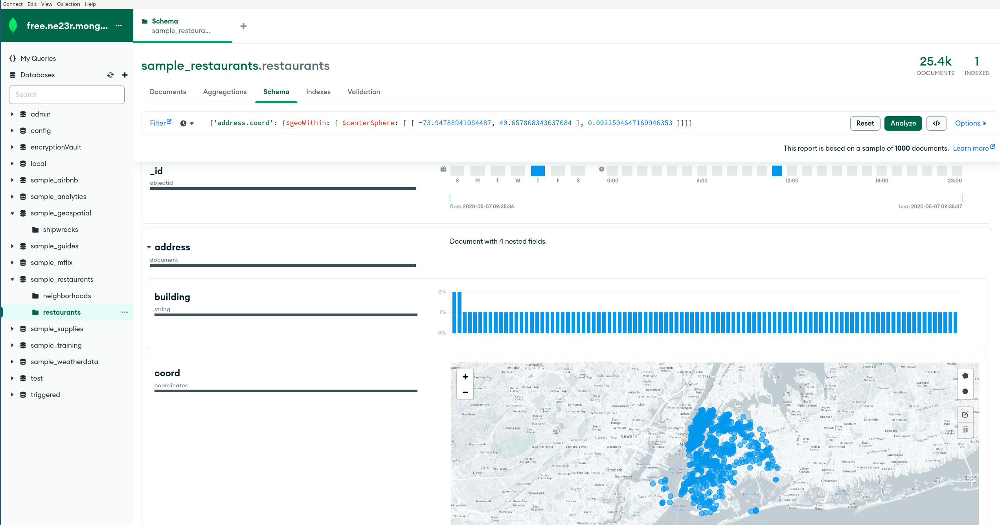
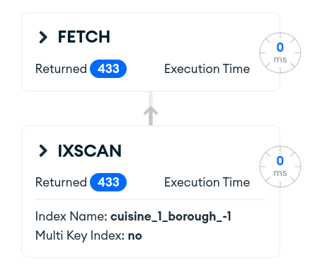
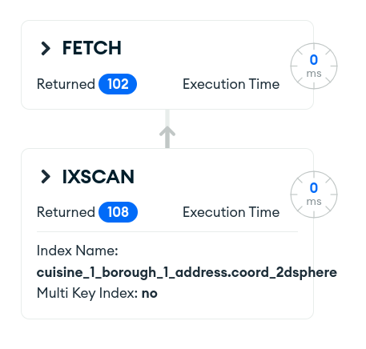
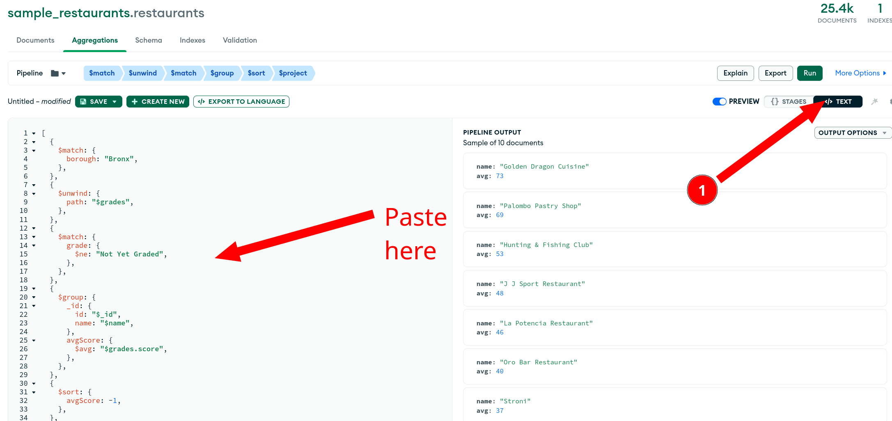
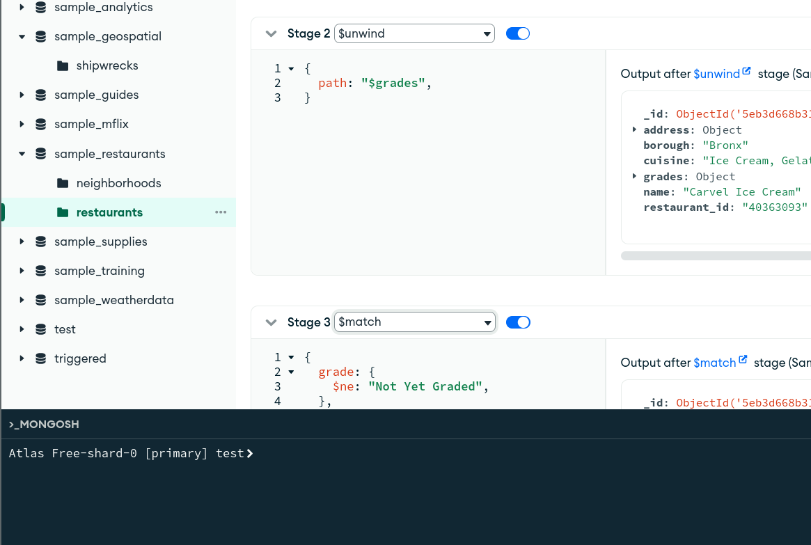

# Compass

## Introduction



[MongoDB Compass](https://www.mongodb.com/products/compass) is the GUI for MongoDB. It enables you to visually explore
your data, run ad hoc queries in seconds and interact with your data with full CRUD functionality. View and optimize
your query performance.

Available on Linux, Mac, or Windows. Compass empowers you to make smarter decisions about indexing, document validation,
and more.

## Download & Install MongoDB Compass

- Download [MongoDB Compass](https://www.mongodb.com/products/compass) in
  the [MongoDB Download Center](https://www.mongodb.com/try/download/compass). Make sure to pick the stable version for
  your operating system.
- [Install Compass](https://www.mongodb.com/docs/compass/master/install/) following your OS instructions.

## Workshop

The goal of this workshop is to make you discover the main features of Compass. The best way to achieve this is to
explore and to be curious. Ask all the questions you have to your instructor.

Here are some challenges and ideas to make you explore some main features but there is more! Feel free to click and
discover as much as possible.

## Document explorer

- Using the `sample_restaurants.restaurants` collection:
    - How many restaurants have the `Hamburgers` cuisine?
    - Can you sort them by `borough` as well?
    - How many indexes are there in this collection?
    - Try the `explain` button. Are you using an index? Can you fix it?

Note: COLLSCAN means that you are scanning the entire collection to answer this query. That's usually a big NO-NO.



## Schema analysis

MongoDB doesn't enforce a fixed schema on the documents by default. Sometimes it's nice to see what our schema looks
like in our collection as a single document might not represent the full picture.

- In the `Schema` tab, explore the fields and check the types.
- Note that the `address` field is a sub-document and can be expended.
- It contains coordinates that appear in a map for convenience.
- Use the map to build a geospatial query. Get the restaurants in the south of Manhattan for example.
- Can you create an index to support this query now?



## Aggregation Pipeline Builder

My favorite feature in MongoDB Compass:
The [Aggregation Pipeline Builder](https://www.mongodb.com/docs/compass/current/aggregation-pipeline-builder/)

- Build some queries and see how the aggregation pipeline builder works.
- For example, you can use your geospatial filter on the `address.coord` field in
  a [$match](https://www.mongodb.com/docs/manual/reference/operator/aggregation/match/) stage. Then use the
  [sortByCount](https://www.mongodb.com/docs/manual/reference/operator/aggregation/sortByCount/) stage on `$cuisine` to
  find what's the most popular type of cuisine in this area.
- Can you find the average grade of the restaurants in the `Bronx`?

```js
[
    {
        '$match': {
            'borough': 'Bronx'
        }
    }, {
        '$unwind': {
            'path': '$grades'
        }
    }, {
        '$match': {
            'grade': {
                '$ne': 'Not Yet Graded'
            }
        }
    }, {
        '$group': {
            '_id': {
                'id': '$_id',
                'name': '$name'
            },
            'avgScore': {
                '$avg': '$grades.score'
            }
        }
    }, {
        '$sort': {
            'avgScore': -1
        }
    }, {
        '$project': {
            'name': '$_id.name',
            'avg': '$avgScore',
            '_id': 0
        }
    }
]
```

- Did you notice that you can import a pipeline like this one directly in Compass to debug & analyse it?



## Mongosh

Have you noticed that Mongosh is directly embedded in MongoDB Compass? If not, check again at the bottom of the
application.



## Conclusion

This MongoDB Compass workshop has provided you with a comprehensive understanding of the tool and its capabilities. You
have learned how to navigate the intuitive interface, perform various data operations, and leverage powerful features
for data analysis and visualization. By mastering MongoDB Compass, you are now equipped with a valuable skill set that
will significantly enhance your ability to work with MongoDB databases efficiently and effectively. Embrace this
knowledge and apply it to your projects to unlock new levels of productivity and success. Happy exploring with MongoDB
Compass!